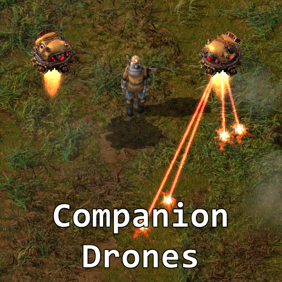

## Companion Drones

--------------------------------------

## How to use
> [!NOTE]
> Companions or their equipment cannot be inserted into the player's armor or gun slots.

1. On Combat tab craft Companion and the needed equipment for it
2. Launch Companion just like a normal Follower robot
3. Click on the drone and insert some fuel and equipment.
4. Done

Attack and construction can be enabled/disabled on the shortcut bar.
